# Basic-10: BASIC to IC10 Compiler for Stationeers


**Version 2.0.0** | By Dog Tired Studios

Basic-10 is a powerful IDE that lets you write programs in BASIC and compiles them to IC10 (MIPS) assembly for use in the game [Stationeers](https://store.steampowered.com/app/544550/Stationeers/).

---

## Main Editor


The main editor features:
- **BASIC code editor** (left) with syntax highlighting and auto-completion
- **IC10 output panel** (bottom-left) showing compiled assembly in real-time
- **Symbols panel** (left sidebar) tracking variables, constants, labels, aliases, and arrays
- **Documentation panel** (right) with quick reference always available
- **Problems panel** (bottom) showing errors and warnings with clickable line numbers

---

## Features

### Code Editor
- Syntax highlighting for BASIC keywords, variables, and IC10 output
- Auto-completion for keywords, device names, and logic types
- Code folding for loops, conditionals, and subroutines
- Bookmarks and breakpoints for navigation
- Real-time error detection with Problems Panel
- Multiple tabs for working with several scripts

### BASIC Language Support
- Variables, constants, and arrays (`DIM`)
- Control flow: `IF/THEN/ELSE`, `WHILE/WEND`, `FOR/NEXT`, `GOSUB/RETURN`
- Compound assignments: `+=`, `-=`, `*=`, `/=`
- Increment/decrement: `++i`, `--i`, `i++`, `i--`
- Bitwise operations: `AND`, `OR`, `XOR`, `NOT`, `<<`, `>>`
- Device I/O with aliases and named device references

### Device Integration
- **Pin aliases** (`ALIAS furnace d0`) for hardware connections
- **Named device references** (`DEVICE furnace "Furnace"`) to bypass the 6-pin limit
- **Extensible device database** with 1500+ Stationeers devices
- **Logic type auto-completion** for device properties

---

## IC10 Simulator & Debugger

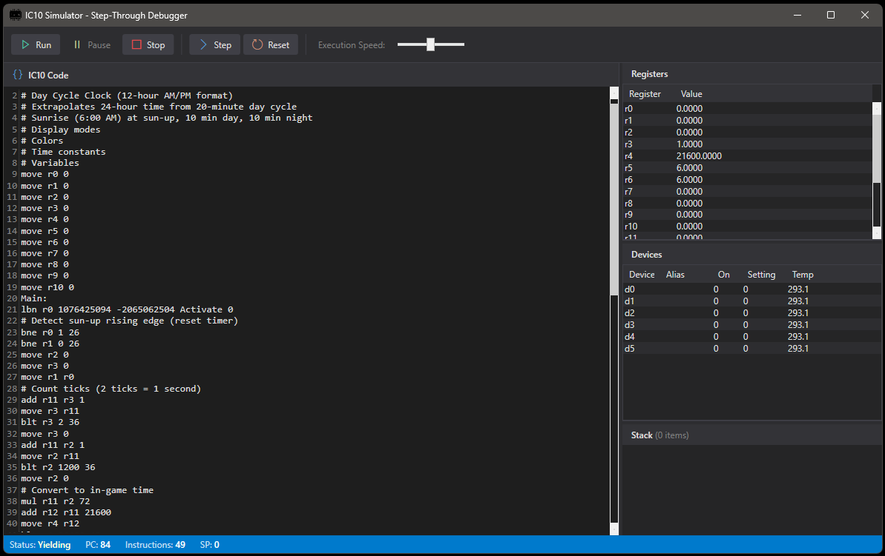

Test your code without launching Stationeers:
- **Step-through debugging** - execute one instruction at a time
- **Register inspection** - view all 18 registers in real-time
- **Device simulation** - set device values for testing
- **Execution speed control** - run slow for debugging or fast for testing
- **Stack visualization** - monitor the call stack

### Variable Inspector

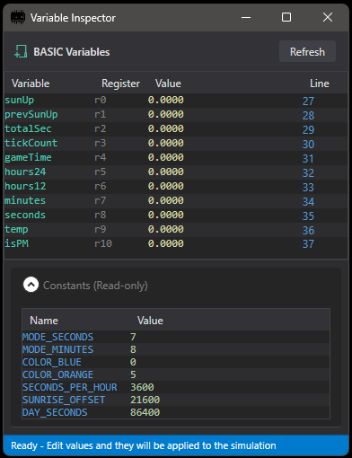

- View BASIC variables mapped to registers
- See constants and their values
- Edit values during simulation
- Track variable changes line-by-line

---

## Device & Logic Hash Database

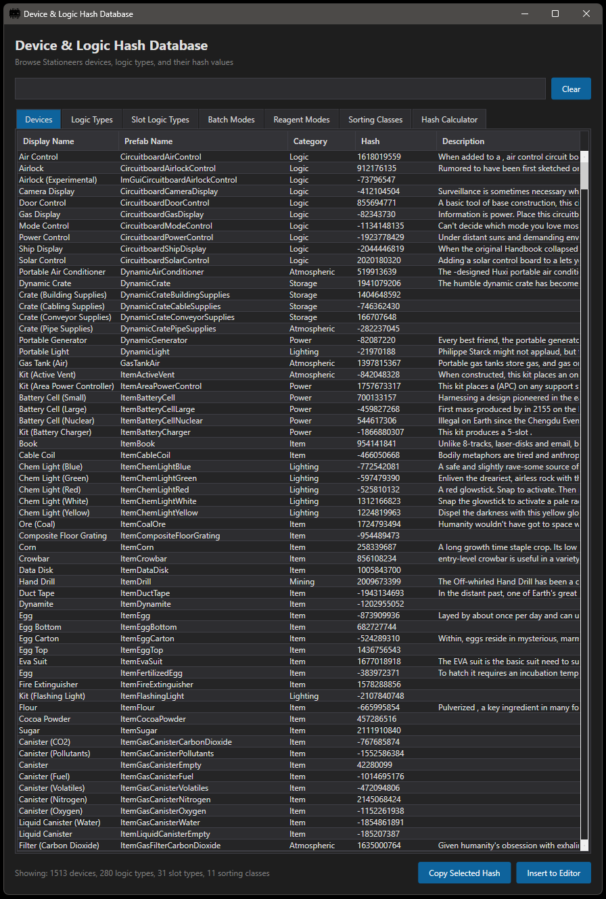

Browse the complete Stationeers device database:
- **1513 devices** with prefab names and hash values
- **280 logic types** for reading/writing device properties
- **31 slot types** for inventory management
- **Sorting classes** for sorting machines
- **Hash calculator** for custom strings

### Logic Types Reference

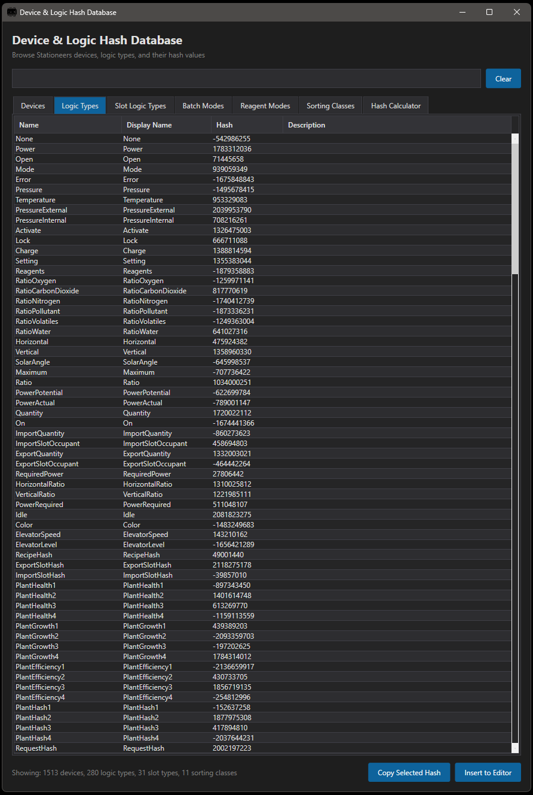

Quick lookup for all device properties like Temperature, Pressure, On, Setting, and more.

### Hash Calculator

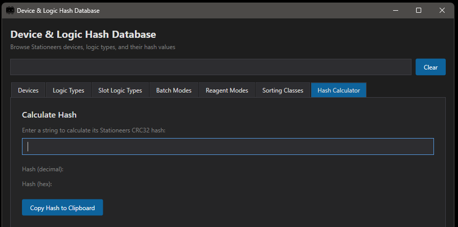

Calculate CRC32 hashes for any string - useful for custom device references.

---

## Integrated Documentation Pane

The Documentation pane is always available in the right panel, with 8 tabs covering everything you need:

### Start Tab - Quick Start Guide

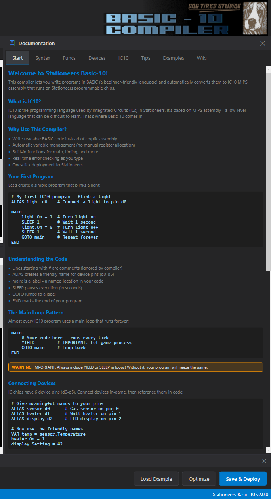

Get started immediately:
- Welcome and introduction to Basic-10
- Your first program walkthrough
- Understanding the code explanations
- The main loop pattern (with YIELD warning)
- Connecting devices basics

### Syntax Tab - Complete Language Reference

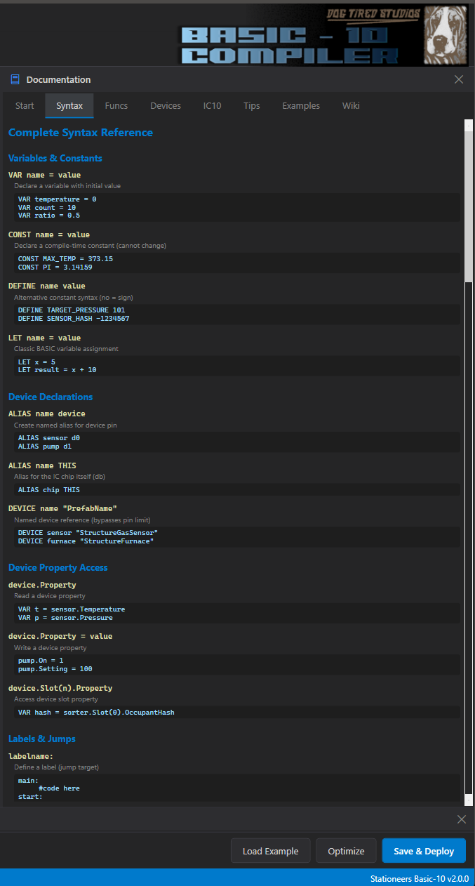

Complete BASIC syntax reference:
- Variables & constants (VAR, CONST, DEFINE, LET)
- Device declarations (ALIAS, DEVICE)
- Device property access with examples
- Labels & jumps (GOTO, GOSUB, RETURN)

### Funcs Tab - Built-in Functions

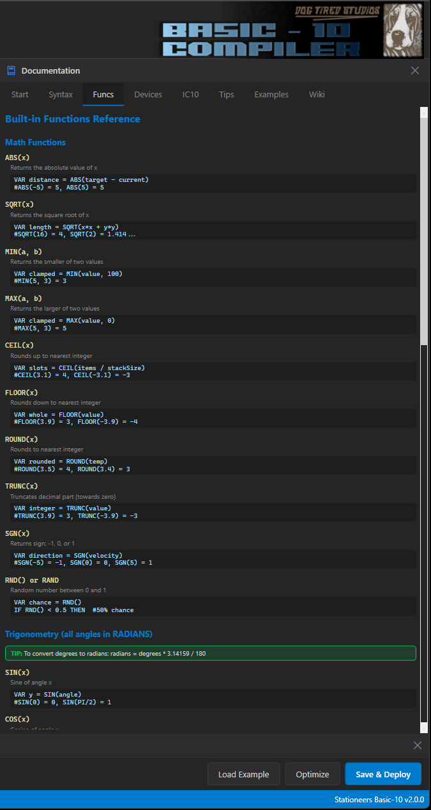

All built-in functions with examples:
- **Math functions**: ABS, SQRT, MIN, MAX, CEIL, FLOOR, ROUND, TRUNC, SGN, RND
- **Trigonometry**: SIN, COS, TAN, ASIN, ACOS, ATAN (with radians tip)
- Usage examples for each function

### Devices Tab - Device Properties Reference

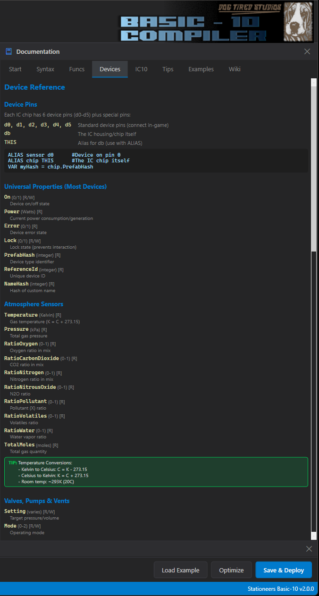

Device property reference organized by category:
- **Device Pins**: d0-d5, db, THIS
- **Universal Properties**: On, Power, Error, Lock, PrefabHash, etc.
- **Atmosphere Sensors**: Temperature, Pressure, RatioOxygen, etc.
- **Valves, Pumps & Vents**: Setting, Mode, and more
- Temperature conversion tips included

### IC10 Tab - MIPS Instruction Reference

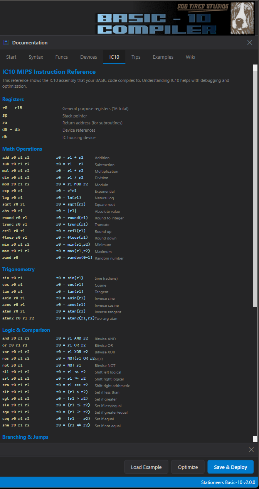

Complete IC10 assembly reference:
- **Registers**: r0-r15, sp, ra, d0-d5, db
- **Math Operations**: add, sub, mul, div, mod, exp, log, sqrt, etc.
- **Trigonometry**: sin, cos, tan, asin, acos, atan
- **Logic & Comparison**: and, or, xor, nor, not, sll, srl, sra, slt, sgt, etc.
- **Branching & Jumps**: Listed below the reference

### Tips Tab - Tips, Tricks & Patterns

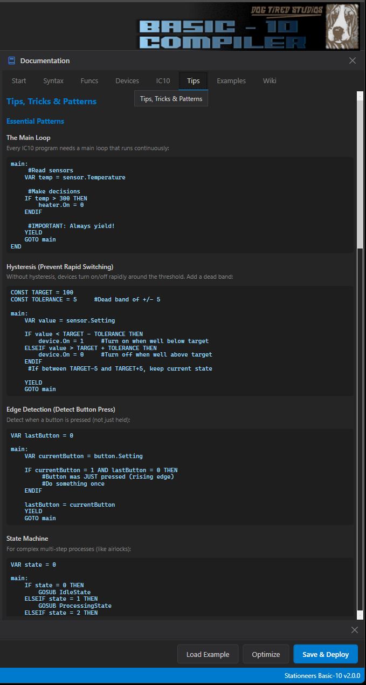

Essential programming patterns:
- **The Main Loop** - proper structure with YIELD
- **Hysteresis** - prevent rapid switching with dead bands
- **Edge Detection** - detect button presses (not holds)
- **State Machine** - for complex multi-step processes like airlocks

### Examples Tab - 19 Ready-to-Use Scripts

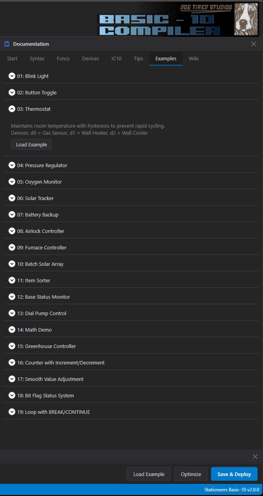

19 complete example scripts you can load directly:
1. Blink Light
2. Button Toggle
3. Thermostat
4. Pressure Regulator
5. Oxygen Monitor
6. Solar Tracker
7. Battery Backup
8. Airlock Controller
9. Furnace Controller
10. Batch Solar Array
11. Item Sorter
12. Base Status Monitor
13. Dial Pump Control
14. Math Demo
15. Greenhouse Controller
16. Counter with Increment/Decrement
17. Smooth Value Adjustment
18. Bit Flag Status System
19. Loop with BREAK/CONTINUE

### Wiki Tab - Integrated Stationeers Wiki

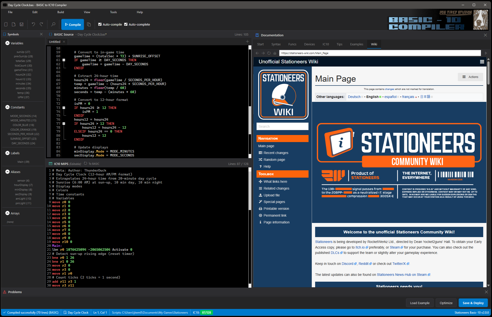

Browse the Stationeers Wiki without leaving the editor:
- Full wiki access with navigation
- Search for devices, items, and game mechanics
- Look up crafting recipes and requirements

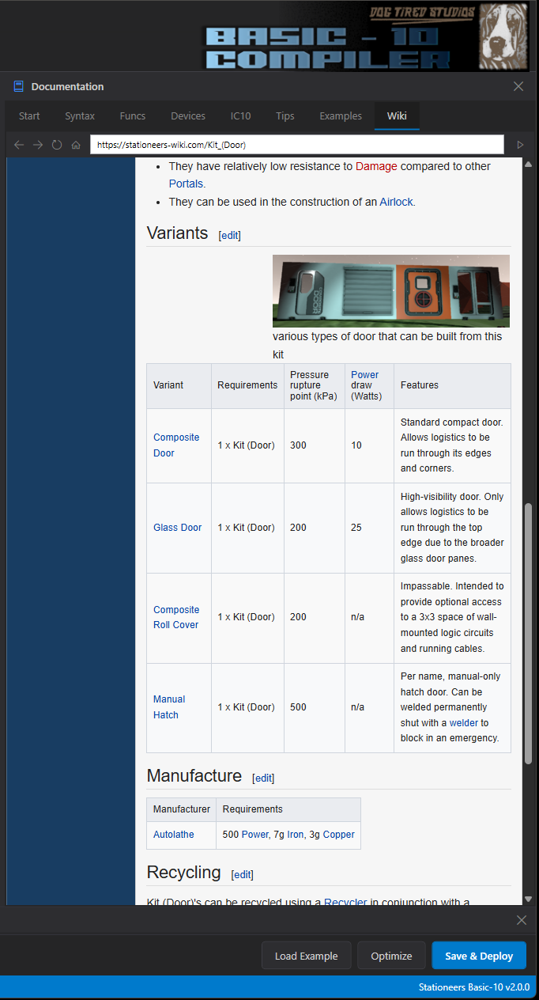

View detailed wiki pages with tables, images, and specifications.

---

## Problems Panel

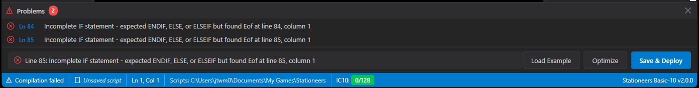

Real-time error detection:
- Syntax errors highlighted as you type
- Clickable line numbers to jump to issues
- Clear error messages with suggestions
- IC10 line count tracking (128 line limit)

---

## Installation

### Requirements
- Windows 10/11 (64-bit)
- No additional dependencies required (self-contained)

### Steps

1. **Download** the latest release: [BasicToMips_v2.0.0.zip](https://github.com/jtwm-0677/Basic-10-Download/releases/latest)

2. **Extract** the ZIP file to a folder of your choice (e.g., `C:\Games\Basic-10\`)

3. **Run** `Basic_10.exe` from the extracted folder

4. **Optional:** Create a desktop shortcut to `Basic_10.exe`

### First Launch
On first launch, Basic-10 will create a settings file in `%LOCALAPPDATA%\BasicToMips\`. The default script demonstrates aliases, variables, loops, and subroutines.

---

## Quick Start Example

```basic
' Atmosphere Monitor - Basic-10 Example
ALIAS sensor d0       ' Gas sensor
ALIAS vent d1         ' Active vent

CONST TARGET = 101.325
CONST TOLERANCE = 5

VAR pressure = 0

main:
    pressure = sensor.Pressure

    IF pressure < TARGET - TOLERANCE THEN
        vent.On = 1
    ELSEIF pressure > TARGET + TOLERANCE THEN
        vent.On = 0
    ENDIF

    YIELD
    GOTO main
```

---

## Changelog

### v2.0.0
- Array support with `DIM` statements
- Compound assignments (`+=`, `-=`, `*=`, `/=`)
- Increment/decrement operators (`++i`, `--i`, `i++`, `i--`)
- Bitwise shift operators (`<<`, `>>`)
- Enhanced Problems Panel with all warnings
- Improved default script with practical examples
- New snippets: Counter, Accumulator, Bit Flags
- Bracket auto-completion for `.Name[""]`
- Updated documentation with 19 examples

### v1.7.3
- MCP server integration via HTTP API
- Auto-save functionality
- Script metadata settings
- Dynamic device aliases
- Named device references

---

## Support

For bug reports and feature requests, please visit the [Issues](https://github.com/jtwm-0677/Basic-10-Download/issues) page.

---

## License

Copyright (c) 2024 Dog Tired Studios. All rights reserved.

This software is provided for personal use in playing Stationeers. The source code is not publicly available.

---

*Built for the Stationeers community*
